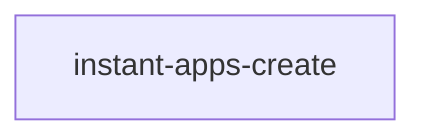

# instant-apps-create

## Description

The `instant-apps-create` component is a tool that can be used to link out to different App builders while including a piece of initial content to use in the app builder creation.

The create tool is configurable. Options include:

- `Content`: The reference to the map, scene, or group that will be used in the app builder.

<!-- Auto Generated Below -->

## Properties

| Property             | Attribute             | Description                                                                                                                                                                                                                                                                                                                                                                     | Type                                             | Default                                                                             |
| -------------------- | --------------------- | ------------------------------------------------------------------------------------------------------------------------------------------------------------------------------------------------------------------------------------------------------------------------------------------------------------------------------------------------------------------------------- | ------------------------------------------------ | ----------------------------------------------------------------------------------- |
| `content`            | --                    | A reference to the Map, Scene, or Group to pass to the App Builder.                                                                                                                                                                                                                                                                                                             | `WebMap \| WebScene \| PortalGroup \| undefined` | `undefined`                                                                         |
| `options`            | --                    | Lists the options displayed in the UI. There are 5 Predefined options. If you need to add custom options, then define a CreateOption entry in the array.                                                                                                                                                                                                                        | `(PredefinedOptions \| CreateOption)[]`          | `['instant-apps', 'map-viewer', 'story-maps', 'experience-builder', 'dashboards'];` |
| `portal`             | --                    | A reference to the Portal.                                                                                                                                                                                                                                                                                                                                                      | `Portal \| undefined`                            | `undefined`                                                                         |
| `mode`               | `mode`                | Renders tool as a popover with a trigger button, or inline to place in a custom container.                                                                                                                                                                                                                                                                                      | `"inline" \| "popover"`                          | `'inline'`                                                                          |
| `popoverIcon`        | `popover-icon`        | Update popover button icon.                                                                                                                                                                                                                                                                                                                                                     | `string \| undefined`                            | `'create'`                                                                          |
| `popoverPlacement`   | `popover-placement`   | Determines where the component will be positioned relative to the `referenceElement`.                                                                                                                                                                                                                                                                                           | `PopoverPlacement \| undefined`                  | `'auto'`                                                                            |
| `popoverPositioning` | `popover-positioning` | Determines the type of positioning to use for the overlaid content. Using `"absolute"` will work for most cases. The component will be positioned inside of overflowing parent containers and will affect the container's layout. `"fixed"` value should be used to escape an overflowing parent container, or when the reference element's position CSS property is `"fixed"`. | `"absolute" \| "fixed" \| undefined`             | `'absolute'`                                                                        |
| `showHeader`         | `show-header`         | Show header toggle.                                                                                                                                                                                                                                                                                                                                                             | `boolean \| undefined`                           | `true`                                                                              |

## Events

| Event | Description | Type |
| ----- | ----------- | ---- |

## CSS Custom Properties

| Name                                            | Description                                            |
| ----------------------------------------------- | ------------------------------------------------------ |
| `--instant-apps-create-action-background`       | Popup's trigger button's background color.             |
| `--instant-apps-create-action-background-hover` | Popup's trigger button's background color on hover.    |
| `--instant-apps-create-action-background-press` | Popup's trigger button's background color on press.    |
| `--instant-apps-create-action-height`           | Popup's trigger button's height.                       |
| `--instant-apps-create-action-icon-color`       | Popup's trigger button's icon color.                   |
| `--instant-apps-create-action-icon-hover-color` | Popup's trigger button's icon color when hovered over. |
| `--instant-apps-create-action-width`            | Popup's trigger button's width.                        |
| `--instant-apps-create-background`              | create's container background color.                   |
| `--instant-apps-create-popover-width`           | create's popover container width.                      |
| `--instant-apps-create-text-color`              | create's container text color.                         |

## Dependencies

### Depends on

### Graph

---

## License

COPYRIGHT © 2024 Esri

All rights reserved under the copyright laws of the United States and applicable international laws, treaties, and conventions.

This material is licensed for use under the Esri Master License Agreement (MLA), and is bound by the terms of that agreement. You may redistribute and use this code without modification, provided you adhere to the terms of the MLA and include this copyright notice.

See use restrictions at http://www.esri.com/legal/pdfs/mla_e204_e300/english

For additional information, contact: Environmental Systems Research Institute, Inc. Attn: Contracts and Legal Services Department 380 New York Street Redlands, California, USA 92373 USA

email: contracts@esri.com
