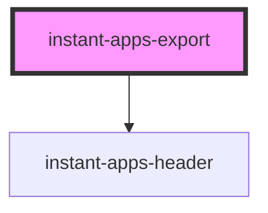

# instant-apps-export

## Description
The `instant-apps-export` component is a tool that can be used in apps to create an output file that includes an image or information from the map or scene view. 

Use the export tool to capture the view as an image and export the output as a PDF file or print it from the browser. If the map is included in the output, the current extent and scale of the view will be captured. This component can be useful in apps where users are looking to create custom images from the app for record keeping or to share results with others. 

The export tool is configurable and can include additional elements in the output, these include:
-	`Legend`: The legend describes the symbols and styles that are used to represent the layers and features in the map, include the legend in the output to provide context about the layers displaying in the map
-	`Popup`: The popup displays content from feature attributes, include popup information from the selected feature in the map in the output
-	`ExtraContent`: Choose additional elements to include in the output, like results or additional text description from an app

<!-- Auto Generated Below -->

## Properties

| Property              | Attribute               | Description                                                                                                                                                                                                                                                                                                                                                                     | Type                                 | Default                   |
| --------------------- | ----------------------- | ------------------------------------------------------------------------------------------------------------------------------------------------------------------------------------------------------------------------------------------------------------------------------------------------------------------------------------------------------------------------------- | ------------------------------------ | ------------------------- |
| `beforeExport`        | --                      | Passes the initial function to run when the Export button is clicked.                                                                                                                                                                                                                                                                                                           | `() => Promise<void>`                | `() => Promise.resolve()` |
| `extraContent`        | --                      | Extra content that will be added below the view.                                                                                                                                                                                                                                                                                                                                | `HTMLElement \| undefined`           | `undefined`               |
| `extraContentLabel`   | `extra-content-label`   | Custom label for `extraContent` checkbox.                                                                                                                                                                                                                                                                                                                                       | `string \| undefined`                | `undefined`               |
| `headerTitle`         | `header-title`          | Export header name, updated in input.                                                                                                                                                                                                                                                                                                                                           | `string \| undefined`                | `''`                      |
| `includeExtraContent` | `include-extra-content` | When `true`, include `extraContent` HTML element in PDF.                                                                                                                                                                                                                                                                                                                        | `boolean \| undefined`               | `true`                    |
| `includeLegend`       | `include-legend`        | When `true`, include legend in export.                                                                                                                                                                                                                                                                                                                                          | `boolean \| undefined`               | `true`                    |
| `includeMap`          | `include-map`           | When `true`, include map in export.                                                                                                                                                                                                                                                                                                                                             | `boolean \| undefined`               | `true`                    |
| `includePopup`        | `include-popup`         | When `true`, include popup in export.                                                                                                                                                                                                                                                                                                                                           | `boolean \| undefined`               | `false`                   |
| `mode`                | `mode`                  | Renders tool as a popover with a trigger button, or inline to place in a custom container.                                                                                                                                                                                                                                                                                      | `"inline" \| "popover"`              | `'popover'`               |
| `output`              | --                      | Output to use to set up export.                                                                                                                                                                                                                                                                                                                                                 | `ExportOutput \| undefined`          | `undefined`               |
| `popoverIcon`         | `popover-icon`          | Update popover button icon.                                                                                                                                                                                                                                                                                                                                                     | `string \| undefined`                | `'export'`                |
| `popoverPlacement`    | `popover-placement`     | Determines where the component will be positioned relative to the `referenceElement`.                                                                                                                                                                                                                                                                                           | `PopoverPlacement \| undefined`      | `'auto'`                  |
| `popoverPositioning`  | `popover-positioning`   | Determines the type of positioning to use for the overlaid content. Using `"absolute"` will work for most cases. The component will be positioned inside of overflowing parent containers and will affect the container's layout. `"fixed"` value should be used to escape an overflowing parent container, or when the reference element's position CSS property is `"fixed"`. | `"absolute" \| "fixed" \| undefined` | `'absolute'`              |
| `scale`               | `scale`                 | Adjusts the scale of the action button.                                                                                                                                                                                                                                                                                                                                         | `"l" \| "m" \| "s" \| undefined`     | `'m'`                     |
| `showHeaderTitle`     | `show-header-title`     | Show header title input.                                                                                                                                                                                                                                                                                                                                                        | `boolean \| undefined`               | `true`                    |
| `showIncludeLegend`   | `show-include-legend`   | Show include legend checkbox.                                                                                                                                                                                                                                                                                                                                                   | `boolean \| undefined`               | `true`                    |
| `showIncludeMap`      | `show-include-map`      | Show include map checkbox.                                                                                                                                                                                                                                                                                                                                                      | `boolean \| undefined`               | `false`                   |
| `showIncludePopup`    | `show-include-popup`    | Show popup checkbox.                                                                                                                                                                                                                                                                                                                                                            | `boolean \| undefined`               | `true`                    |
| `showScaleBar`        | `show-scale-bar`        | Show scale bar widget in map.                                                                                                                                                                                                                                                                                                                                                   | `boolean \| undefined`               | `true`                    |
| `view`                | --                      | MapView or SceneView to reference when filtering.                                                                                                                                                                                                                                                                                                                               | `MapView \| SceneView \| undefined`  | `undefined`               |

## Events

| Event                 | Description                                                                                       | Type                |
| --------------------- | ------------------------------------------------------------------------------------------------- | ------------------- |
| `exportOutputUpdated` | Emits when the instant-apps-export's output prop is updated after the "Export" button is clicked. | `CustomEvent<void>` |

## CSS Custom Properties

| Name                                            | Description                                            |
| ----------------------------------------------- | ------------------------------------------------------ |
| `--instant-apps-export-action-icon-color`       | Popup's trigger button's icon color.                   |
| `--instant-apps-export-action-icon-hover-color` | Popup's trigger button's icon color when hovered over. |
| `--instant-apps-export-action-width`            | Popup's trigger button's width.                        |
| `--instant-apps-export-background`              | Export's container background color.                   |
| `--instant-apps-export-popover-width`           | Export's popover container width.                      |
| `--instant-apps-export-text-color`              | Export's container text color.                         |

## Dependencies

### Depends on

- [instant-apps-header](../instant-apps-header)

### Graph

----------------------------------------------

## License
COPYRIGHT © 2023 Esri

All rights reserved under the copyright laws of the United States and applicable international laws, treaties, and conventions.

This material is licensed for use under the Esri Master License Agreement (MLA), and is bound by the terms of that agreement. You may redistribute and use this code without modification, provided you adhere to the terms of the MLA and include this copyright notice.

See use restrictions at http://www.esri.com/legal/pdfs/mla_e204_e300/english

For additional information, contact: Environmental Systems Research Institute, Inc. Attn: Contracts and Legal Services Department 380 New York Street Redlands, California, USA 92373 USA

email: contracts@esri.com

