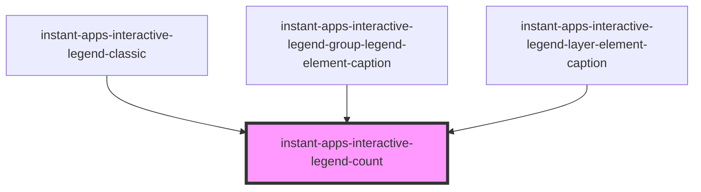

# instant-apps-interactive-legend-count

<!-- Auto Generated Below -->

## Properties

| Property          | Attribute     | Description | Type                                                                                                                               | Default     |
| ----------------- | ------------- | ----------- | ---------------------------------------------------------------------------------------------------------------------------------- | ----------- |
| `activeLayerInfo` | --            |             | `ActiveLayerInfo`                                                                                                                  | `undefined` |
| `categoryId`      | `category-id` |             | `string`                                                                                                                           | `undefined` |
| `infoIndex`       | `info-index`  |             | `number`                                                                                                                           | `undefined` |
| `legendElement`   | --            |             | `ColorRampElement \| HeatmapRampElement \| OpacityRampElement \| RelationshipRampElement \| SizeRampElement \| SymbolTableElement` | `undefined` |
| `legendvm`        | --            |             | `LegendViewModel`                                                                                                                  | `undefined` |
| `messages`        | `messages`    |             | `any`                                                                                                                              | `undefined` |
| `selected`        | `selected`    |             | `boolean`                                                                                                                          | `undefined` |
| `showTotal`       | `show-total`  |             | `boolean`                                                                                                                          | `false`     |

## Dependencies

### Used by

 - [instant-apps-interactive-legend-classic](../instant-apps-interactive-legend-classic)
 - [instant-apps-interactive-legend-group-legend-element-caption](../instant-apps-interactive-legend-group-legend-element-caption)
 - [instant-apps-interactive-legend-layer-element-caption](../instant-apps-interactive-legend-layer-element-caption)

### Graph

----------------------------------------------

## License
COPYRIGHT © 2023 Esri

All rights reserved under the copyright laws of the United States and applicable international laws, treaties, and conventions.

This material is licensed for use under the Esri Master License Agreement (MLA), and is bound by the terms of that agreement. You may redistribute and use this code without modification, provided you adhere to the terms of the MLA and include this copyright notice.

See use restrictions at http://www.esri.com/legal/pdfs/mla_e204_e300/english

For additional information, contact: Environmental Systems Research Institute, Inc. Attn: Contracts and Legal Services Department 380 New York Street Redlands, California, USA 92373 USA

email: contracts@esri.com

