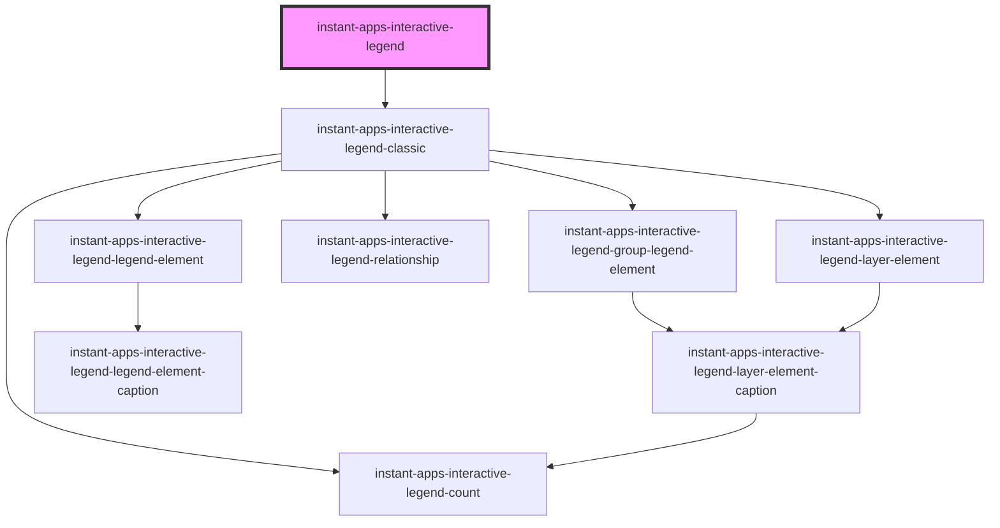

# instant-apps-interactive-legend (Beta)

## Description

The `instant-apps-interactive-legend` component allows a user to filter layers by changing the visibility of features in the map view based on types and ranges from the legend.

This tool is useful to narrow in on certain layer categories represented by symbols or styles in the map. While using the legend, if you click on a style type or range, the features that do not use that drawing style will be filtered out of the map.

Consider including properties like `featureCount`, `filterMode`, and `zoomTo` to as actions to use while data in the map is being filtered out. In the legend only certain drawing styles can be used to filter layers, the supported [drawing styles](https://doc.arcgis.com/en/arcgis-online/create-maps/apply-styles-mv.htm#ESRI_SECTION1_195BD40347774AEDAEC373A7A0898A80) include:

- Types(Unique symbols)
- Counts and amounts (Size)
- Counts and amounts (Color)
- Relationship
- Predominant category
- Predominant category and size
- Types and size

### Prerequisites

This component is only compatible with [ArcGIS Online feature layers](https://doc.arcgis.com/en/arcgis-online/reference/feature-layers.htm#ESRI_SECTION1_26EBAE21F63042B9A51A4312A08A1B25) or [ArcGIS Server feature layers](https://doc.arcgis.com/en/arcgis-online/reference/feature-layers.htm#ESRI_SECTION1_0BEFA4197C154A219A5B113039AB73F2)

<!-- Auto Generated Below -->

## Properties

| Property       | Attribute       | Description                                                                                             | Type         | Default                     |
| -------------- | --------------- | ------------------------------------------------------------------------------------------------------- | ------------ | --------------------------- |
| `featureCount` | `feature-count` | Display the individual counts for categories and total counts for layers in the legend                  | `boolean`    | `false`                     |
| `filterMode`   | --              | Use effects to differentiate between features that are included and excluded from legend filter results | `FilterMode` | `{     type: 'filter',   }` |
| `view`         | --              | Reference to Map View                                                                                   | `MapView`    | `undefined`                 |
| `zoomTo`       | `zoom-to`       | Displays ‘Zoom to’ button, updates the extent of the view based on the results from the legend          | `boolean`    | `false`                     |

## Dependencies

### Depends on

- [instant-apps-interactive-legend-classic](instant-apps-interactive-legend-classic)

### Graph

---

## License

COPYRIGHT © 2024 Esri

All rights reserved under the copyright laws of the United States and applicable international laws, treaties, and conventions.

This material is licensed for use under the Esri Master License Agreement (MLA), and is bound by the terms of that agreement. You may redistribute and use this code without modification, provided you adhere to the terms of the MLA and include this copyright notice.

See use restrictions at http://www.esri.com/legal/pdfs/mla_e204_e300/english

For additional information, contact: Environmental Systems Research Institute, Inc. Attn: Contracts and Legal Services Department 380 New York Street Redlands, California, USA 92373 USA

email: contracts@esri.com
