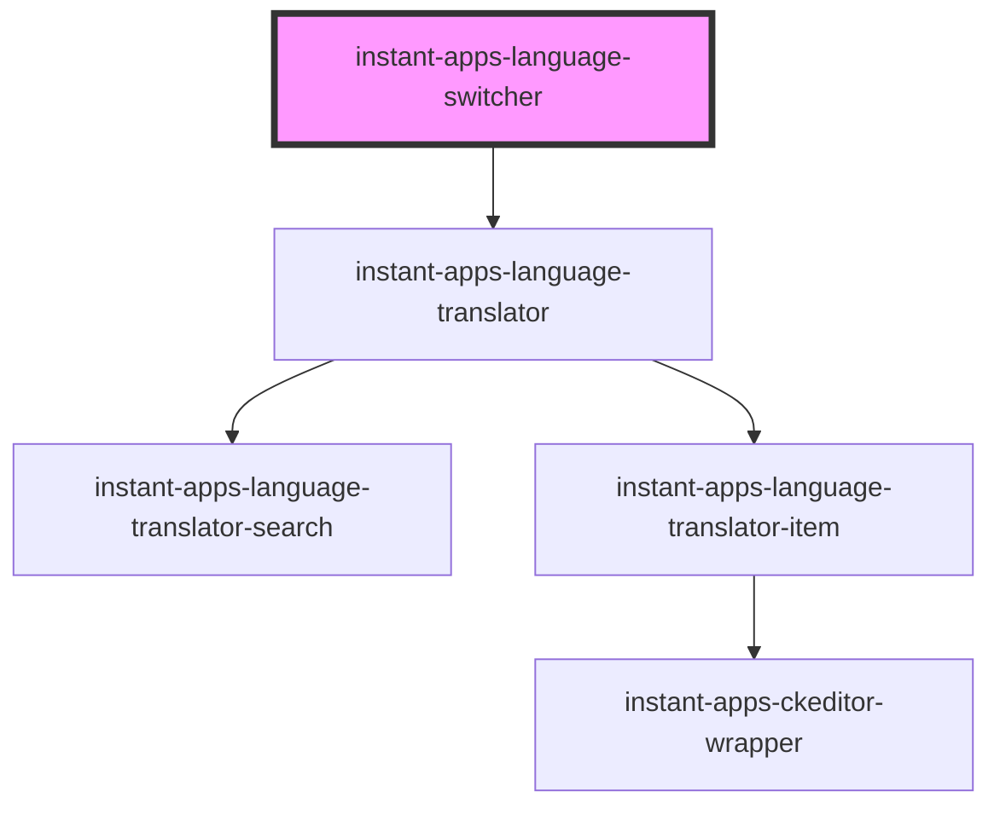

# instant-apps-language-switcher

Language switcher provides end users with the ability to translate a web app's UI by selecting a language from a dropdown.

## Typings

```
  interface LocaleItem {
    locale: string;
    webmap?: string;
  }
```

## Examples

### Basic usage:

```
  <instant-apps-language-switcher
    icon={icon}
    locales={locales}
    portalItem={portalItem}
  />
```

### Locales

```
[
    ...
    {
        "locale": "ja"
    },
    {
        "locale": "el"
    },
    {
        "locale": "fr"
    }
    ...
]
```

### Events

```
document.addEventListener("selectedLanguageUpdated", (e: CustomEvent) => {
 const data = e.detail;
 // Write logic to apply strings throughout your app here.
});
```

<!-- Auto Generated Below -->


## Properties

| Property                            | Attribute                              | Description                                                                                                                                                                                                                                                                                                                                                         | Type                                                  | Default      |
| ----------------------------------- | -------------------------------------- | ------------------------------------------------------------------------------------------------------------------------------------------------------------------------------------------------------------------------------------------------------------------------------------------------------------------------------------------------------------------- | ----------------------------------------------------- | ------------ |
| `calciteDropdownOverlayPositioning` | `calcite-dropdown-overlay-positioning` | Determines the type of positioning to use for the overlaid content. Using "absolute" will work for most cases. The component will be positioned inside of overflowing parent containers and will affect the container's layout. "fixed" should be used to escape an overflowing parent container, or when the reference element's position CSS property is "fixed". | `"absolute" \| "fixed"`                               | `'absolute'` |
| `defaultLocale`                     | `default-locale`                       | Defines the default language of the language switcher dropdown. Set internally if not defined.                                                                                                                                                                                                                                                                      | `string \| undefined`                                 | `undefined`  |
| `icon`                              | `icon`                                 | Icon to display.                                                                                                                                                                                                                                                                                                                                                    | `string`                                              | `'language'` |
| `locales`                           | --                                     | Data used to populate language switcher dropdown.                                                                                                                                                                                                                                                                                                                   | `{ locale: string; webmap?: string \| undefined; }[]` | `[]`         |
| `portalItem` _(required)_           | --                                     | Instant App portal item - used to fetch it's associated portal item resource. The portal item resource will contain the user defined translated strings.                                                                                                                                                                                                            | `PortalItem`                                          | `undefined`  |
| `selectedLanguage`                  | `selected-language`                    | The currently selected language.                                                                                                                                                                                                                                                                                                                                    | `null \| string`                                      | `null`       |
| `view`                              | --                                     | Reference to map view to switch web maps if present in locales.                                                                                                                                                                                                                                                                                                     | `MapView \| SceneView \| undefined`                   | `undefined`  |


## Events

| Event                     | Description                                                                                                                                                                                                  | Type                                                                               |
| ------------------------- | ------------------------------------------------------------------------------------------------------------------------------------------------------------------------------------------------------------ | ---------------------------------------------------------------------------------- |
| `selectedLanguageUpdated` | Fires when a language is selected from the dropdown. This event will emit an object containing the information on the selected language and a flat object of unique identifiers and their associated values. | `CustomEvent<{ locale: string; data?: { [key: string]: string; } \| undefined; }>` |


## Methods

### `refresh() => Promise<void>`

Refreshes the component by fetching the latest translation data from the portal item resource.

#### Returns

Type: `Promise<void>`


## Dependencies

### Depends on

- [instant-apps-language-translator](../instant-apps-language-translator)

### Graph


----------------------------------------------

## License
COPYRIGHT © 2024 Esri

All rights reserved under the copyright laws of the United States and applicable international laws, treaties, and conventions.

This material is licensed for use under the Esri Master License Agreement (MLA), and is bound by the terms of that agreement. You may redistribute and use this code without modification, provided you adhere to the terms of the MLA and include this copyright notice.

See use restrictions at http://www.esri.com/legal/pdfs/mla_e204_e300/english

For additional information, contact: Environmental Systems Research Institute, Inc. Attn: Contracts and Legal Services Department 380 New York Street Redlands, California, USA 92373 USA

email: contracts@esri.com

