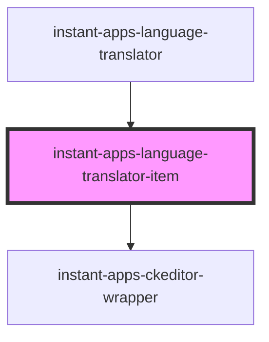

# instant-apps-language-translator-item

<!-- Auto Generated Below -->

## Properties

| Property                                | Attribute    | Description                                                                                                                                                                                                                                                                                                               | Type                                                                                                | Default     |
| --------------------------------------- | ------------ | ------------------------------------------------------------------------------------------------------------------------------------------------------------------------------------------------------------------------------------------------------------------------------------------------------------------------- | --------------------------------------------------------------------------------------------------- | ----------- |
| `fieldName`                             | `field-name` | Unique identifier tied to an associated setting in an app.                                                                                                                                                                                                                                                                | `string`                                                                                            | `undefined` |
| `setting`                               | --           | Object containing data that describes the UI i.e. icon to indicate type of setting, label, value, etc.                                                                                                                                                                                                                    | `LocaleSettingData`                                                                                 | `undefined` |
| `translatedLanguageLabels`              | --           | Object containing labels of items in currently selected language.                                                                                                                                                                                                                                                         | `{ [key: string]: string; }`                                                                        | `undefined` |
| `translatedLocaleInputOnChangeCallback` | --           | Function that is called when the value in a translated locale's input has changed. This function will have 4 arguments - fieldName, value, locale, and resource - and will return a promise. The callback function can be used to construct the data of key-value pairs that will be written to the portal item resource. | `(fieldName: string, value: string, locale: string, resource: PortalItemResource) => Promise<void>` | `undefined` |
| `userLocaleInputOnChangeCallback`       | --           | Function to be called when the value in a user locale input has changed. This function will have 2 arguments - fieldName and value - and will return a promise.                                                                                                                                                           | `(fieldName: string, value: string) => Promise<void>`                                               | `undefined` |

## Events

| Event                       | Description                                         | Type                |
| --------------------------- | --------------------------------------------------- | ------------------- |
| `translatorItemDataUpdated` | Fires when a translation input's value has changed. | `CustomEvent<void>` |

## Dependencies

### Used by

 - [instant-apps-language-translator](..)

### Depends on

- [instant-apps-ckeditor-wrapper](../instant-apps-ckeditor-wrapper)

### Graph

----------------------------------------------

## License
COPYRIGHT © 2024 Esri

All rights reserved under the copyright laws of the United States and applicable international laws, treaties, and conventions.

This material is licensed for use under the Esri Master License Agreement (MLA), and is bound by the terms of that agreement. You may redistribute and use this code without modification, provided you adhere to the terms of the MLA and include this copyright notice.

See use restrictions at http://www.esri.com/legal/pdfs/mla_e204_e300/english

For additional information, contact: Environmental Systems Research Institute, Inc. Attn: Contracts and Legal Services Department 380 New York Street Redlands, California, USA 92373 USA

email: contracts@esri.com

