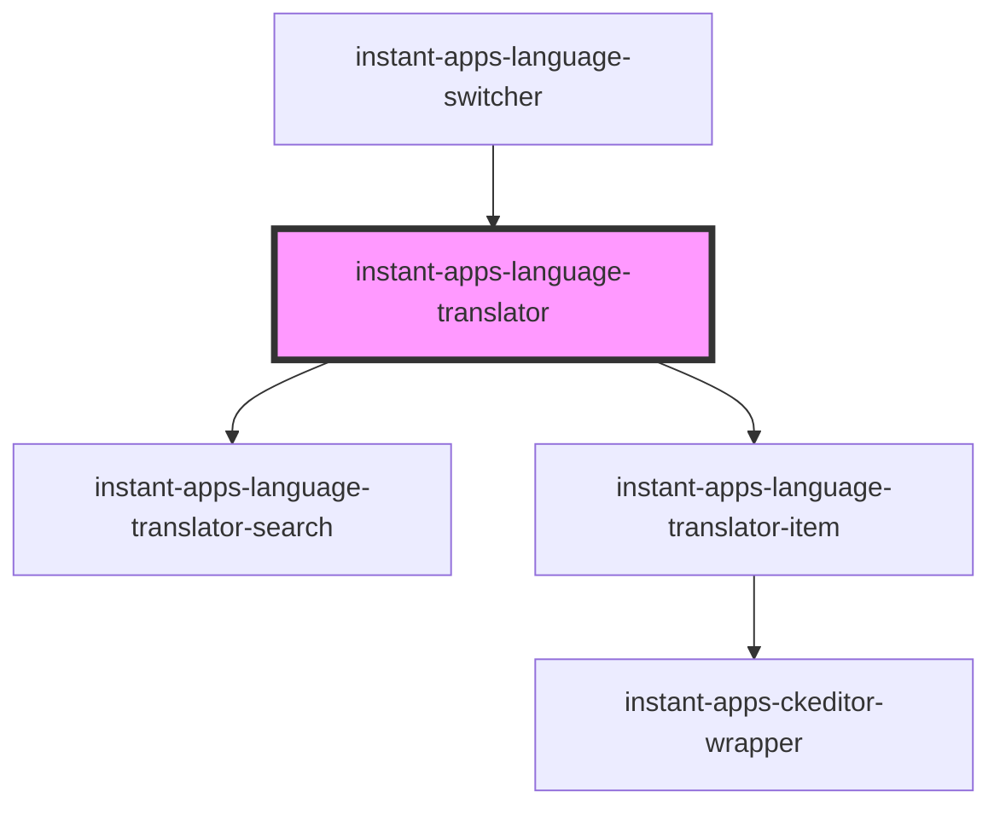

# instant-apps-language-translator

Language translator provides a UI to edit user-defined strings in a an end-user's language along with translations of selected languages. The languages currently supported in the language translator component are languages supported in ArcGIS Online. A list of the supported can be found [here](https://doc.arcgis.com/en/arcgis-online/get-started/set-language-region.htm#GUID-A3CDEC64-1A27-4F12-A05D-5DA12309AF06).

## Interfaces

```
 interface AppSettings {
  
 }
```

<!-- Auto Generated Below -->


## Properties

| Property                                | Attribute      | Description                                                                                                                                                                                                                                                                                                               | Type                                                                                               | Default     |
| --------------------------------------- | -------------- | ------------------------------------------------------------------------------------------------------------------------------------------------------------------------------------------------------------------------------------------------------------------------------------------------------------------------- | -------------------------------------------------------------------------------------------------- | ----------- |
| `appSettings`                           | `app-settings` | Data object containing a series of key-value pairs used to render the components UI.                                                                                                                                                                                                                                      | `any`                                                                                              | `undefined` |
| `locales`                               | --             | Specified languages that the user-defined strings will be translated in.                                                                                                                                                                                                                                                  | `LocaleItem[]`                                                                                     | `undefined` |
| `open`                                  | `open`         | Controls the open/close state of the modal.                                                                                                                                                                                                                                                                               | `boolean`                                                                                          | `false`     |
| `portalItem` _(required)_               | --             | Instant App portal item - used to fetch it's associated portal item resource. The portal item resource will contain the user defined translated strings.                                                                                                                                                                  | `PortalItem`                                                                                       | `undefined` |
| `translatedLocaleInputOnChangeCallback` | --             | Function that is called when the value in a translated locale's input has changed. This function will have 4 arguments - fieldName, value, locale, and resource - and will return a promise. The callback function can be used to construct the data of key-value pairs that will be written to the portal item resource. | `(fieldName: string, value: string, locale: string, resource: PortalItemResource) => Promise<any>` | `undefined` |
| `userLocaleInputOnChangeCallback`       | --             | Function to be called when the value in a user locale input has changed. This function will have 2 arguments - fieldName and value - and will return a promise.                                                                                                                                                           | `(fieldName: string, value: string) => Promise<void>`                                              | `undefined` |


## Events

| Event                   | Description | Type                  |
| ----------------------- | ----------- | --------------------- |
| `translatorDataUpdated` |             | `CustomEvent<string>` |


## Dependencies

### Used by

 - [instant-apps-language-switcher](../instant-apps-language-switcher)

### Depends on

- [instant-apps-language-translator-search](instant-apps-language-translator-search)
- [instant-apps-language-translator-item](instant-apps-language-translator-item)

### Graph


----------------------------------------------

## License
COPYRIGHT © 2023 Esri

All rights reserved under the copyright laws of the United States and applicable international laws, treaties, and conventions.

This material is licensed for use under the Esri Master License Agreement (MLA), and is bound by the terms of that agreement. You may redistribute and use this code without modification, provided you adhere to the terms of the MLA and include this copyright notice.

See use restrictions at http://www.esri.com/legal/pdfs/mla_e204_e300/english

For additional information, contact: Environmental Systems Research Institute, Inc. Attn: Contracts and Legal Services Department 380 New York Street Redlands, California, USA 92373 USA

email: contracts@esri.com

