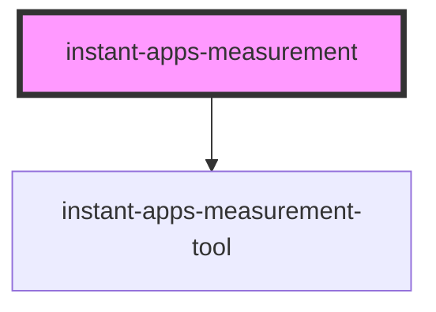

# instant-apps-measurement

## Description
 
 The `instant-apps-measurement` component is a tool that is used in apps to calculate measurements for distance, area and coordinates in a map or scene view. 

The measurement tool consists of four tools in the component: 
- **Distance measurement**: Determines and displays the distance between two or more points in the view
- **Area measurement**: Calculates and displays the area and perimeter of a polygon in the view
- **Coordinate conversion**: Measures the coordinates of a point in the view and provides additional formats to convert the coordinate to 
- **Clear measurement**: Used to clear any existing measurements calculated using the tools in the component   

<!-- Auto Generated Below -->

## Properties

| Property           | Attribute           | Description                                                             | Type                                                                                                                                                                                                                                                        | Default     |
| ------------------ | ------------------- | ----------------------------------------------------------------------- | ----------------------------------------------------------------------------------------------------------------------------------------------------------------------------------------------------------------------------------------------------------- | ----------- |
| `activeToolType`   | `active-tool-type`  | Determine the tool that will be open on load                            | `"area" \| "clear" \| "distance" \| "point"`                                                                                                                                                                                                                | `undefined` |
| `areaUnit`         | `area-unit`         | Choose which unit will be used for the area tool by default             | `"acres" \| "ares" \| "hectares" \| "square-centimeters" \| "square-decimeters" \| "square-feet" \| "square-inches" \| "square-kilometers" \| "square-meters" \| "square-miles" \| "square-millimeters" \| "square-us-feet" \| "square-yards" \| undefined` | `undefined` |
| `coordinateFormat` | `coordinate-format` | Choose which formats to include as options while converting coordinates | `string \| undefined`                                                                                                                                                                                                                                       | `undefined` |
| `linearUnit`       | `linear-unit`       | Choose which unit will be used for the distance tool by default         | `"centimeters" \| "decimeters" \| "feet" \| "inches" \| "kilometers" \| "meters" \| "miles" \| "millimeters" \| "nautical-miles" \| "us-feet" \| "yards" \| undefined`                                                                                      | `undefined` |
| `view`             | --                  | A reference to the MapView or SceneView                                 | `MapView \| SceneView`                                                                                                                                                                                                                                      | `undefined` |

## Events

| Event           | Description                                                                                                        | Type                   |
| --------------- | ------------------------------------------------------------------------------------------------------------------ | ---------------------- |
| `measureActive` | Emits when there is an active measure tool to allow app devs to disable other tools/popups when tools are active . | `CustomEvent<boolean>` |

## Dependencies

### Depends on

- [instant-apps-measurement-tool](instant-apps-measurement-tool)

### Graph

----------------------------------------------

## License
COPYRIGHT © 2023 Esri

All rights reserved under the copyright laws of the United States and applicable international laws, treaties, and conventions.

This material is licensed for use under the Esri Master License Agreement (MLA), and is bound by the terms of that agreement. You may redistribute and use this code without modification, provided you adhere to the terms of the MLA and include this copyright notice.

See use restrictions at http://www.esri.com/legal/pdfs/mla_e204_e300/english

For additional information, contact: Environmental Systems Research Institute, Inc. Attn: Contracts and Legal Services Department 380 New York Street Redlands, California, USA 92373 USA

email: contracts@esri.com

