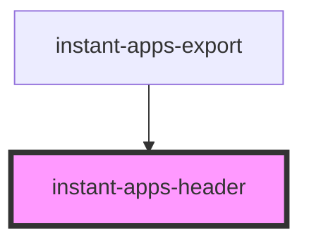

# instant-apps-header

<!-- Auto Generated Below -->

## Properties

| Property                | Attribute                 | Description                                                                         | Type                            | Default                         |
| ----------------------- | ------------------------- | ----------------------------------------------------------------------------------- | ------------------------------- | ------------------------------- |
| `backgroundColor`       | `background-color`        | Background color to display in header - accepts a hexidecimal value i.e. `#000000`. | `string`                        | `undefined`                     |
| `customHeaderCss`       | `custom-header-css`       | CSS styles to be used in conjuction with `custom-header-html`.                      | `string`                        | `undefined`                     |
| `customHeaderHtml`      | `custom-header-html`      | HTML code for custom headers.                                                       | `string`                        | `undefined`                     |
| `fontFamily`            | `font-family`             | Font family to use for text                                                         | `string`                        | `'var(--calcite-sans-family);'` |
| `headerAlignment`       | `header-alignment`        | Change alignment of header.                                                         | `"center" \| "left" \| "right"` | `'left'`                        |
| `infoButton`            | `info-button`             | Display info button at the end of the title.                                        | `boolean`                       | `false`                         |
| `infoIsOpen`            | `info-is-open`            | Keeps track of the info 'open' state                                                | `boolean`                       | `false`                         |
| `infoTitleText`         | `info-title-text`         | Hover text for info button tooltip                                                  | `string`                        | `undefined`                     |
| `logoImage`             | `logo-image`              | Image URL for logo. Displays at the start of the header.                            | `string`                        | `undefined`                     |
| `logoImageAltText`      | `logo-image-alt-text`     | Alternate text for header logo.                                                     | `string`                        | `undefined`                     |
| `logoLink`              | `logo-link`               | Logo URL to link out to another page.                                               | `string`                        | `undefined`                     |
| `logoScale`             | `logo-scale`              | Adjusts scale of logo image.                                                        | `"l" \| "m" \| "s"`             | `'m'`                           |
| `mobileWidthBreakpoint` | `mobile-width-breakpoint` | Mobile breakpoint value in pixels(px).                                              | `number`                        | `widthBreakpoints.medium[1]`    |
| `textColor`             | `text-color`              | Text color to display in header - accepts a hexidecimal value i.e. `#FFFFFF`.       | `string`                        | `undefined`                     |
| `titleText`             | `title-text`              | Main text to display in header.                                                     | `string`                        | `undefined`                     |
| `titleTextLink`         | `title-text-link`         | Url to link out to from title text                                                  | `string`                        | `undefined`                     |

## Events

| Event               | Description                            | Type                   |
| ------------------- | -------------------------------------- | ---------------------- |
| `infoIsOpenChanged` | Fires when the info button is clicked. | `CustomEvent<boolean>` |

## Slots

| Slot            | Description                                                                                        |
| --------------- | -------------------------------------------------------------------------------------------------- |
| `"actions-end"` | Used to slot an action at the end of the header i.e. `calcite-action`, `instant-apps-social-share` |

## CSS Custom Properties

| Name                                               | Description                                                                       |
| -------------------------------------------------- | --------------------------------------------------------------------------------- |
| `--instant-apps-header-height`                     | Height for header. Default: auto;                                                 |
| `--instant-apps-header-height--logo-scale--l`      | Header height when logo scale is set to 'l'. Default value is 80px.               |
| `--instant-apps-header-height--logo-scale--m`      | Header height when logo scale is set to 'm'. Default value is 70px.               |
| `--instant-apps-header-height--logo-scale--s`      | Header height when logo scale is set to 's'. Default value is 55px.               |
| `--instant-apps-header-logo-height--logo-scale--l` | Logo height when logo scale is set to 'l'. Default value: 60px.                   |
| `--instant-apps-header-logo-height--logo-scale--m` | Logo height when logo scale is set to 'm'. Default value: 50px.                   |
| `--instant-apps-header-logo-height--logo-scale--s` | Logo height when logo scale is set to 's'. Default value: 35px.                   |
| `--instant-apps-header-logo-width--logo-scale--l`  | Logo width when logo scale is set to 'l'. Default value: 60px.                    |
| `--instant-apps-header-logo-width--logo-scale--m`  | Logo width when logo scale is set to 'm'. Default value: 50px.                    |
| `--instant-apps-header-logo-width--logo-scale--s`  | Logo width when logo scale is set to 's'. Default value: 35px.                    |
| `--instant-apps-header-min-height`                 | Minimum height for header. Default: 50px;                                         |
| `--instant-apps-header-title-text-link-decoration` | Text decoration for hyperlinks for `titleTextLink`. Default value is 'underline'. |

## Dependencies

### Used by

 - [instant-apps-export](../instant-apps-export)

### Graph

----------------------------------------------

## License
COPYRIGHT © 2023 Esri

All rights reserved under the copyright laws of the United States and applicable international laws, treaties, and conventions.

This material is licensed for use under the Esri Master License Agreement (MLA), and is bound by the terms of that agreement. You may redistribute and use this code without modification, provided you adhere to the terms of the MLA and include this copyright notice.

See use restrictions at http://www.esri.com/legal/pdfs/mla_e204_e300/english

For additional information, contact: Environmental Systems Research Institute, Inc. Attn: Contracts and Legal Services Department 380 New York Street Redlands, California, USA 92373 USA

email: contracts@esri.com

